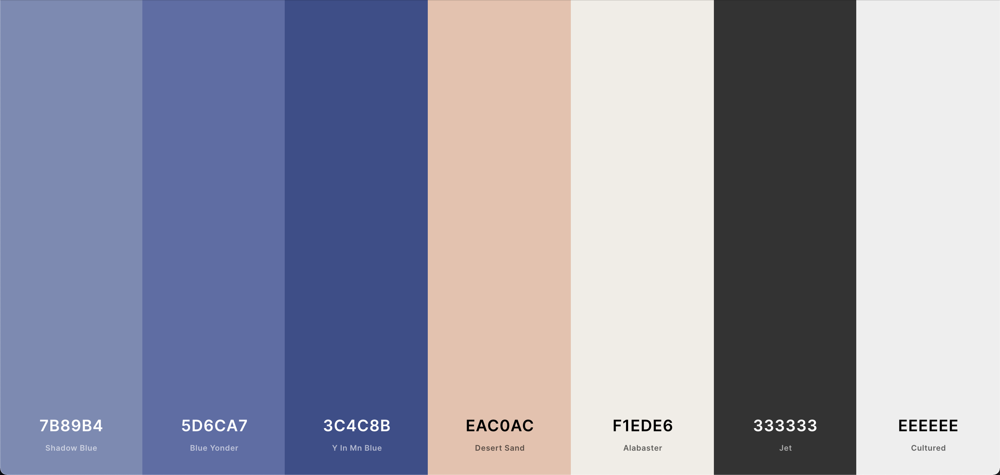
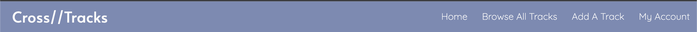
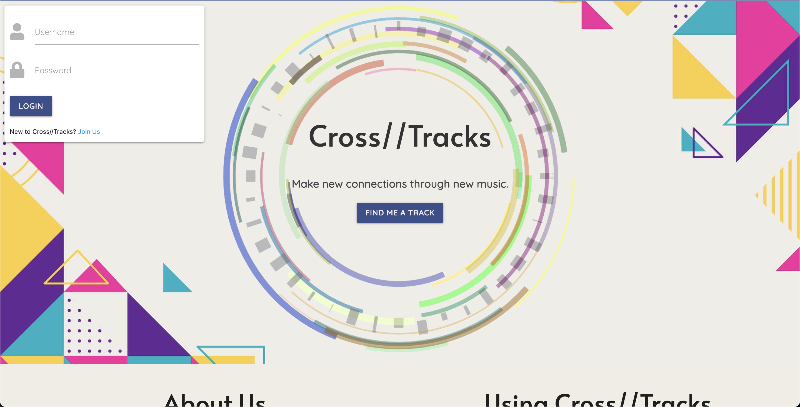
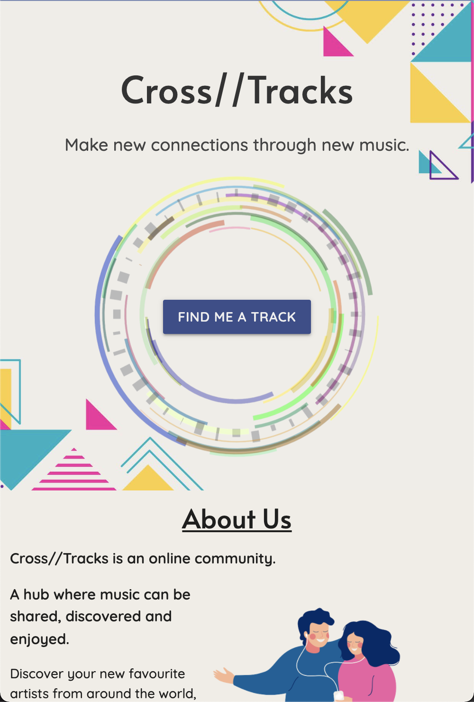
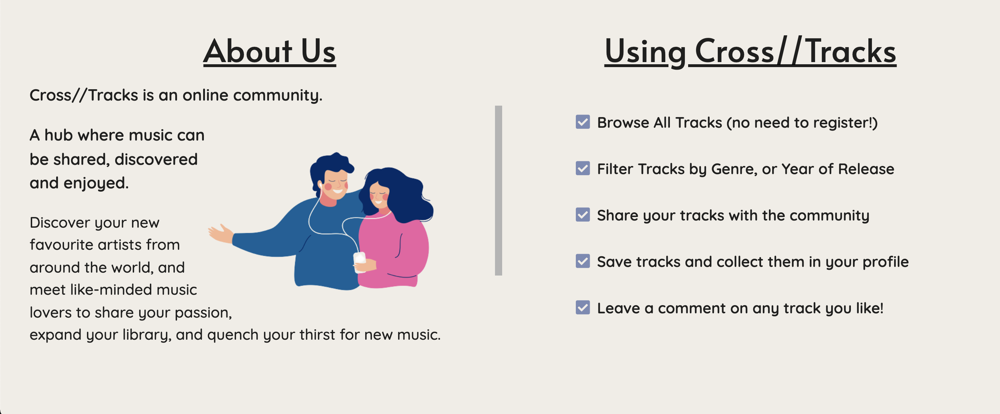
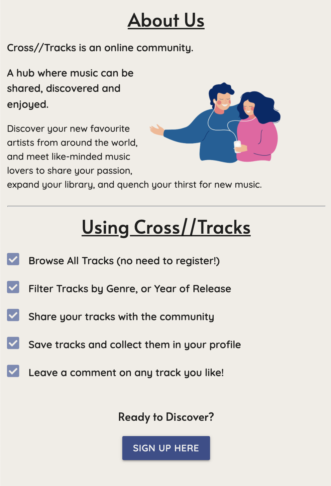

# Cross//Tracks
Cross//Tracks is an online music sharing platform, where music lovers around the world can share their favourite tracks, and expand on their own collection of music with new discoveries shared by the Cross//Tracks community.

The platform will allow users to browse a complete list of shared tracks, search/filter tracks by Genre, Artist Name or Year of Release, leave comments, and give tracks a star rating.

## UX
### Strategy
#### Vision
Having been an active member in the musical community for more than a decade, and being a life long lover of music, there have been many occasions where I have reached a plateau when trying to find new artists and music that I really enjoy and get stuck into. Discovering new music often involves endless scouring of music label websites, YouTube and Spotify. While it is indeed a fun past time, it is rare that an artist or track is discovered that truly speaks to me. However, there is of course another way to discover music, which is through word of mouth; of recommendation. It's much more often that I find great music when I am listening to, or talking about music with a friend. As well as being a more efficient way to discover great music, it's also a lot more enjoyable to appreciate music around other music lovers.

With this, the vision of Cross//Tracks is to provide users with the ability to find music by recommendation, and to build a friendly community of like-minded musical aficionados, who can rely on eachother when they're in need of a new musical fix.

#### Site Owner Goals

1. To create a robust platform, which they themselves can enjoy and discover music through.
2. Implement CRUD (Create, Read, Update, Delete) functionality, allowing users to add, edit and delete their recommendations.
3. Implement defensive design through application of data validation and authentication.
4. To allow for simple and intuitive navigation, and understanding of the website.
5. Establish Cross//Tracks as a trusted and recognisable brand to both new and returning visitors.
6. Provide excellent UX to maximise visitor’s dwell time and minimise bounce rate, so as to maximise SEO and brand recognition.
7. Employ a mobile-first design, while ensuring the website is responsive across all device sizes.

#### Target Audience

Potential visitors to the website could include:

1. Music Fans - The Cross//Tracks website could serve as a solution, in the case where people who attend listening parties aren't able to meet in person and trade music and ideas. This case is particularly topical since the COVID-19 pandemic has resulted in the inability for people to meet up in person, and trade or enjoy music together.
2. Younger people - The platform could be particularly attractive to the younger generation (16-25 years), who are generally more tech savvy, inclined to social media trends, and would welcome a social media platform centered around sharing and discovering music.
3. Musicians - Musicians may use the website to market their own tracks using the Cross//Tracks platform.

#### User Stories

As a visitor using the website for the first time, I want...

1. The purpose of the website to be clearly evident upon first visit, so I can be sure that my needs will be met.
2. To be able to navigate the website intuitively and with ease, so that my time isn't wasted.
3. To view tracks without having to register, so I can determine whether the website suits my needs.
4. To be able to search for tracks based on different criteria (Genre, Artist Name, Year of Release), so I can search for tracks more granularly.
5. To view comments on a particular track, so I find out what other users have to say about the music and engage with the community.
6. To see a description of how to use the service, so I can be aware of all features on offer.

As a returning visitor, I want...

1. To be able to read and write comments on tracks which have been shared by others, so I can communicate and build relationships with other users of the website.
2. The details of users who share a particular track to be clearly visible, so I can browse their profile and find out more about their musical tastes.
3. To register and build my own profile, so I am able to locate my saved tracks.
4. To be able to Add, Edit and Delete my own track information, so I can share tracks with other users of the website.
5. To be able to save/like tracks which I come across when browsing, so they are saved to my profile.
6. To be able to contact the site owner, so I can leave feedback. 
7. To be able to reset my password so I can access the website if I forget my password.

As a musician using the website, I want...

1. To be able to display that I am an artist to other users of the platform, so I can market myself and grow my fanbase.
2. To view and edit my tracks easily, so I can manage my online presence.
3. A filter option for 'Cross//Tracks Artists', so users can easily find tracks added by me.
4. View how many 'likes' my tracks have, so I can determine how well my fanbase is growing.

#### In or Out?

Below is a table to weight the importance of features in first release, against the feasibility of implementation.

| Feature/Opportunity | Importance (score out of 5) | Feasibility/Viability (score out of 5) | In or Out? |
| --- | --- | --- | --- |
| Home Page, displaying all Tracks | 5 | 5 | In |
| Register/Login/Logout | 5 | 5 | In |
| Full CRUD Functionality | 5 | 5 | In |
| Page for users to Create, Read, Update, Delete Tracks | 5 | 5 | In |
| Display tracks on cards |  5 | 5 | In |
| Click button on card to visit user's profile | 4 | 4 | In |
| Search/Filter by Genre/Artist Functionality | 5 | 4 | In |
| Profile Page for Users | 5 | 4 | In |
| 'Like Button' for Tracks | 4 | 4 | In |
| Upload and display profile picture | 3 | 3 | Out |
| Edit Profile Page | 5 | 5 | In |
| Add user as friend | 4 | 2 | Out |
| Message users directly | 3 | 1 | Out |
| Play selected track directly from website | 4 | 1 | Out |
| Display users Spotify playlist | 3 | 1 | Out |
| Manage Tracks (as Admin) | 5 | 5 | In |
| Manage Genres (as Admin) | 5 | 5 | In |
| Contact Page | 4 | 5 | In |
| 404 Page | 5 | 5 | In |
| Fully Responsive Website | 5 | 5 | In |

### Scope

Unfortunately, some trade-offs will have to be considered in order complete the project in time for the production deployment deadline. Since the central focus of the platform is to share music, it would of course be ideal if users had the option to sample the tracks on display from the website directly. Perhaps there is a chance that this functionality can be achieved through the utilisation of Spotify's API; if there is sufficient time once the features for an MVP have been implemented, then efforts will indeed be made for a playback feature to be implemented. Furthermore, it would be ideal for users to be able to message eachother, so that communities can be grow and more music can be discovered. It is currently beyond the scope of the developer's skillset to implement a messaging service.

Until then, below are the main features required for a Minimal Viable Product:

1. Home Page displaying all tracks
2. Ability to Register, Login and Logout
3. Full CRUD Functionality to Add, Read, Edit and Delete Tracks.
4. A page for users to add tracks to the platform.
5. Cards to display tracks, with button to open modal/dropdown
6. Modal window/dropdown to display more information and comments left about relative tracks.
7. Search/Filter functionality
8. "Like Button", with likes displayed on track cards.
9. Profile Page for Users
10. Functionality for users to edit profile
11. Contact Page
12. 404 Page
13. Admin Priveleges (to manage Genres and Tracks)

Features for future releases:

1. Enable users to play tracks directly from the website.
2. Allow users to message eachother directly.
3. Allow users to add eachother as friends.
4. Display users Spotify playlists
5. Upload and display a user profile picture

### Structure

The structure of the website is listed below, numbered in order from top to bottom level:

1. Home Page
    1. Navigation Bar/Brand Logo - A navigation bar will be displayed at the top level of the home page and all subsequent pages. This will collapse to a hamburger icon on mobile screen sizes.
    2. Login Form - To provide a better UX, a small login form will be featured below the navigation bar, inviting the user to login (or register if they have not done so.)
    3. Cards displaying added tracks - All tracks added by users will be featured in the centre of the page.
    4. Modal window - Users can find out more about individual tracks by clicking on the cards, which will trigger a modal window showing more information about the relative track. Users will be able to like and comment on tracks, and a link to the profile of the user who added the track will also be displayed.
    5. Filter by Genre - Tabs featuring Genre names will be present, filtering all tracks based on which Genre is selected.
    6. Footer - Social Media/Spotify/Github Links will be displayed at the bottom level of the Home Page.

2. Login Page - As well as being able to login directly from the home page, users will also be able to visit a dedicated Login Page.
    1. Navigation Bar
    2. Login Form
    3. Footer

3. Registration Page
    1. Navigation Bar
    2. Registration Form (with breadcrumbs to provide feedback)
    3. Footer

4. Profile Page - Here users can display and edit their own profile for other users to view. Profile pages can be visited by clicking a link on the modal windows featured in the website's Home Page. 
    1. Navigation Bar
    2. Profile Image
    3. Details - First Name, Last Name, Age, About Me
    4. Personal Tracklist, a list of all tracks added by this user
    5. Subject to time before deadline: A spotify player featuring users spotify playlists (if they fill in their Spotify username upon registration)

5. 'Add a Track' Page
    1. Navigation Bar
    2. Form to add details of a track
    3. Footer

6. Contact Page
    1. Navigation Bar
    2. Short paragraph inviting users to submit any questions of feedback
    3. Contact Form
    4. Footer
    

#### Database

The noSQL database MongoDB Atlas will handle all the data being used in the Cross//Tracks website, including user details, track information and comments. 

The ERD (Entity Relationship Diagram) below depicts the data, and the relationship between specific items of data.

### Skeleton
#### Wireframes

Links to the wireframes are below:

* [Home Page](documentation/wireframes/cross-tracks-homepage.pdf)
* [Register Page](documentation/wireframes/cross-tracks-register.pdf)
* [Login Page](documentation/wireframes/cross-tracks-login.pdf)
* [Add Track Page](documentation/wireframes/cross-tracks-add-track.pdf)
* [Browse Tracks Page](documentation/wireframes/cross-tracks-search-tracks.pdf)
* [User Profile](documentation/wireframes/cross-tracks-user-profile.pdf)
* [User Profile (editable)](documentation/wireframes/cross-tracks-editable-profile.pdf)
* [Edit Profile](documentation/wireframes/cross-tracks-profile-edit.pdf)

### Surface

#### Design

##### General Considerations

The website's background features a design which serves to frame the content of each page. This background design is prevalent on all pages of the website. Since this background design features a fair amount of variation in it's colour scheme, a more monochromatic approach to the colour scheme was considered, particularly for the more high-level elements of the page, such as the track cards, and card modals. A monochromatic approach was determined to compliment the relatively busier colour scheme of the website's background image.

##### Colour Palette

* #7b89b4 (Shadow Blue) - The colour 'Shadow Blue' is used for the website's navigation bar on laptop and desktop devices, as well as the sidenav bar for iPad and mobile devices, and the website's footer. This colour is also featured in the website's user profile page, at the top level, where the user details and profile image are displayed.

* #5d6ca7 (Blue Yonder) - This colour is used for the MaterializeCSS Cards and Modals to display track information, comments and images in the website's 'Browse Tracks' and 'User Profile' pages. These colours were chosen in consistency with the monochromatic consideration (between the cards and the navigation bar. 

* 3c4c8b (Y in Mn Blue) - This colour is featured on all buttons throughout the website, as well as being used as a secondary colour in the website's 'User Profile' page, serving as a banner to provide a background to the text content (username and email). The decision for this colour to be used as a banner was to provide a distinction between the user's primary details and the user's other details (name, location, age, description); the latter of which sits atop the ligther 'Shadow Blue' colour. 

* #f1ede6 (Alabaster) - This colour is used as the background colour for the website's Home, Login, Build Profile, Add Track and Registration pages, as well as for all sections displaying track cards and modals to delete and edit tracks and user's accounts. The contrast between this colour and the prevalent blue colour should provide contrast between background and foreground elements.

* #eac0ac (Desert Sand) - This colour is used for the buttons displayed on the track cards (More info, Edit and Delete). Although this colour goes against the monochromatic approach, it was deemed that this colour against the blue background was rather aesthetically pleasing. 

* #333333 (Jet) - This colour is used for all text content which sits on top of a light background, such as the text content in the website's Home Page and Build Profile page, the headers in Registration, Login,  and the section header banners in Browse Tracks and User Profile pages. This colour was chosen simply to contrast against the light background, whilst also not being too dark. The colour is also used on all buttons which feature a lighter colour.

* #eeeeee (Cultured) - This colour is used for the text content in the website's navigation, sidenav and footer elements, as well as track cards and modals, and all buttons which feature a darker 'Y in Mn Blue' colour.

##### Typography

The website uses the Google Fonts library to provide the typefaces:

* Alata - Used for the website's logo, headers, track names and usernames.

* Quicksand - Used for track details, additional user details (in User Profile page), form text inputs and all buttons throughout website. This font was chosen as it nicely complimented the 'Alata' font used for the headers of the website.

##### Icons

Icons for the website were provided by the FontAwesome library, and were used in the buttons on track cards, to represent the actions a user could take with regards to displaying more information, editing, or deleting a track. Icons are also used in the list of options in the top level of the Browse Tracks page. A hamburger icon is also used for the website's collapsible navbar. 

Clickable FontAwesome star icons are also used to represent a clickable button for the user to 'like' a track, and save it to their profile. A speech bubble icon is used alongside the number of comments that is left on a particular track, to concisely represent that the numbers are related to the amount of comments a track has.

##### Images

The website features a main background image which is featured on all pages of the website except the User Profile page, as well as serving as the background for the header banners in the 'Browse Tracks' and 'User Profile' pages.

The website's logo is used in the hero section of the Home Page, as well as being used as a default track image (should the user not provide an image URL). This logo is also used for the website's favicon.

Vector images are used at the top level in the 'Add a Track' and 'Contact' pages, as well as being used in lower level elements in some pages, such as the 'About Us' section in the 'Home' page, and accompanying the 'No Tracks' message in the User Profile 'My Tracks' and 'Liked Tracks' sections.

## Features

### Global Features

#### Navbar

Each page features a fully responsive navigation bar, with a logo displayed on the left hand side on laptop/desktop devices, and centred on tablet and mobile devices. 

When viewing on a tablet or mobile device, the navbar collapses to a FontAwesome hamburger icon, which opens a side navigation bar when clicked. The side navigation bar can also be accessed by dragging from the left hand side.

#### Footer

A footer is also present on all pages of the website, featuring 'quick links' for the user to visit Register, Login or Contact pages. Once logged in, both 'Login' and 'Register' links are replaced with one 'Logout' link (the Contact link remains present in both logged-out and logged-in states).

### Home Page

At the top level, the website's homepage features the Cross//Tracks logo as it's hero/background image, and within it is the Cross//Tracks header, with a lead paragraph. Below this is a button 'Find Me A Track', which takes the user to the 'Browse Tracks' page.

On laptop and desktop devices, a small login window is present in the top left corner of the section, to allow for ease of use for users who are already registered to the website. The login window also features a message in small tags, inviting the user to click the link to visit the website's Registration page, if they haven't signed up already.

On mobile devices, the website header and lead paragraph are contained within the website's logo, to allow for lack of screen real-estate in comparison with laptop and desktop devices.

On the lower level of the homepage, there are two sections. One section features a brief overview of the purpose of Cross//Tracks, accompanied with a light-hearted vector of two people listening to music through the same headphones.

The second section is a list detailing what Cross//Tracks have to offer; an indication as to how to use Cross//Tracks. The list is bulleted with FontAwesome check icons, to accentuate and give some visual feedback to the bulleted points.

These two sections collapse to full-width columns on iPad and mobile devices, with a button at the bottom of the page, inviting the user to register to the service. This button takes the user to the website's Registration page.

### Features left to Implement

