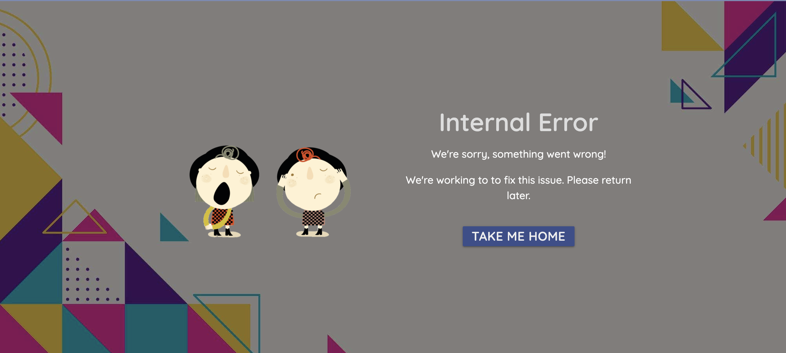

# Cross//Tracks
Cross//Tracks is an online music sharing platform, where music lovers around the world can share their favourite tracks, and expand on their own collection of music with new discoveries shared by the Cross//Tracks community.

The platform will allow users to browse a complete list of shared tracks, search/filter tracks by Genre, Artist Name or Year of Release, leave comments, and give tracks a star rating.


## UX
### Strategy
#### Vision
Having been an active member in the musical community for more than a decade, and being a life long lover of music, there have been many occasions where I have reached a plateau when trying to find new artists and music that I really enjoy and get stuck into. Discovering new music often involves endless scouring of music label websites, YouTube and Spotify. While it is indeed a fun past time, it is rare that an artist or track is discovered that truly speaks to me. However, there is of course another way to discover music, which is through word of mouth; of recommendation. It's much more often that I find great music when I am listening to, or talking about music with a friend. As well as being a more efficient way to discover great music, it's also a lot more enjoyable to appreciate music around other music lovers.

With this, the vision of Cross//Tracks is to provide users with the ability to find music by recommendation, and to build a friendly community of like-minded musical aficionados, who can rely on eachother when they're in need of a new musical fix.

#### Site Owner Goals

1. To create a robust platform, which they themselves can enjoy and discover music through.
2. Implement CRUD (Create, Read, Update, Delete) functionality, allowing users to add, edit and delete their recommendations.
3. Implement defensive design through application of data validation and authentication.
4. To allow for simple and intuitive navigation, and understanding of the website.
5. Establish Cross//Tracks as a trusted and recognisable brand to both new and returning visitors.
6. Provide excellent UX to maximise visitor’s dwell time and minimise bounce rate, so as to maximise SEO and brand recognition.
7. Employ a mobile-first design, while ensuring the website is responsive across all device sizes.

#### Target Audience

Potential visitors to the website could include:

1. Music Fans - The Cross//Tracks website could serve as a solution, in the case where people who attend listening parties aren't able to meet in person and trade music and ideas. This case is particularly topical since the COVID-19 pandemic has resulted in the inability for people to meet up in person, and trade or enjoy music together.
2. Younger people - The platform could be particularly attractive to the younger generation (16-25 years), who are generally more tech savvy, inclined to social media trends, and would welcome a social media platform centered around sharing and discovering music.
3. Musicians - Musicians may use the website to market their own tracks using the Cross//Tracks platform.


#### User Stories

As a visitor using the website for the first time, I want...

1. The purpose of the website to be clearly evident upon first visit, so I can be sure that my needs will be met.
2. To be able to navigate the website intuitively and with ease, so that my time isn't wasted.
3. To view tracks without having to register, so I can determine whether the website suits my needs.
4. To be able to search for tracks based on different criteria (Genre, Artist Name, Year of Release), so I can search for tracks more granularly.
5. To view comments on a particular track, so I find out what other users have to say about the music and engage with the community.
6. To view how many likes a particular track has, so I can determine which tracks are popular.


As a returning visitor, I want...

1. To be able to write and edit comments on tracks which have been shared by others, so I can communicate and build relationships with other users of the website.
2. The details of users who share a particular track to be clearly visible, so I can browse their profile and find out more about their musical tastes.
3. To be able to Add, Edit and Delete my own profile, so I can manage my personal information with ease.
4. To be able to Add, Edit and Delete my own track information, so I can share tracks with other users of the website.
5. To be able to save/like tracks which I come across when browsing, so they are saved to my profile.
6. To be able to contact the site owner, so I can leave feedback. 
7. To be able to reset my password so I can access the website if I forget my password.

As a musician using the website, I want...

1. To be able to display that I am an artist to other users of the platform, so I can market myself and grow my fanbase.
2. To display my artist status on track cards, so users can easily find tracks added by me.
3. View how many 'likes' my tracks have, so I can determine how well my fanbase is growing.

#### In or Out?

Below is a table to weight the importance of features in first release, against the feasibility of implementation.

| Feature/Opportunity | Importance (score out of 5) | Feasibility/Viability (score out of 5) | In or Out? |
| --- | --- | --- | --- |
| Home Page, displaying all Tracks | 5 | 5 | In |
| Register/Login/Logout | 5 | 5 | In |
| Full CRUD Functionality | 5 | 5 | In |
| Page for users to Create, Read, Update, Delete Tracks | 5 | 5 | In |
| Display tracks on cards |  5 | 5 | In |
| Click button on card to visit user's profile | 4 | 4 | In |
| Search/Filter by Genre/Artist Functionality | 5 | 4 | In |
| Add/Edit/Delete Comments | 5 | 4 | In |
| Profile Page for Users | 5 | 4 | In |
| 'Like Button' for Tracks | 4 | 4 | In |
| Upload and display profile picture | 3 | 3 | Out |
| Edit Profile Page | 5 | 5 | In |
| Add user as friend | 4 | 2 | Out |
| Message users directly | 3 | 1 | Out |
| Play selected track directly from website | 4 | 1 | Out |
| Display users Spotify playlist | 3 | 1 | Out |
| Manage Tracks (as Admin) | 5 | 5 | In |
| Manage Genres (as Admin) | 5 | 5 | In |
| Contact Page | 4 | 5 | In |
| 404 Page | 5 | 5 | In |
| Fully Responsive Website | 5 | 5 | In |

### Scope

Unfortunately, some trade-offs will have to be considered in order complete the project in time for the production deployment deadline. Since the central focus of the platform is to share music, it would of course be ideal if users had the option to sample the tracks on display from the website directly. Perhaps there is a chance that this functionality can be achieved through the utilisation of Spotify's API; if there is sufficient time once the features for an MVP have been implemented, then efforts will indeed be made for a playback feature to be implemented. Furthermore, it would be ideal for users to be able to message eachother, so that communities can be grow and more music can be discovered. It is currently beyond the scope of the developer's skillset to implement a messaging service.

Until then, below are the main features required for a Minimal Viable Product:

1. Home Page displaying all tracks
2. Ability to Register, Login and Logout
3. Full CRUD Functionality to Add, Read, Edit and Delete Tracks.
4. A page for users to add tracks to the platform.
5. Cards to display tracks, with button to open modal/dropdown
6. Modal window/dropdown to display more information and comments left about relative tracks.
7. Functionality for users to leave comments
8. Search/Filter functionality
9. "Like Button", with likes displayed on track cards.
10. Profile Page for Users
11. Functionality for users to edit profile
12. Contact Page
13. 404 Page
14. Admin Priveleges (to manage Genres and Tracks)

Features for future releases:

1. Enable users to play tracks directly from the website.
2. Allow users to message eachother directly.
3. Allow users to add eachother as friends.
4. Display users Spotify playlists
5. Upload and display a user profile picture


### Structure

The structure of the website is listed below, numbered in order from top to bottom level:

1. Home Page
    1. Navigation Bar/Brand Logo - A navigation bar will be displayed at the top level of the home page and all subsequent pages. This will collapse to a hamburger icon on mobile screen sizes.
    2. Login Form - To provide a better UX, a small login form will be featured below the navigation bar, inviting the user to login (or register if they have not done so.)
    3. Cards displaying added tracks - All tracks added by users will be featured in the centre of the page.
    4. Modal window - Users can find out more about individual tracks by clicking on the cards, which will trigger a modal window showing more information about the relative track. Users will be able to like and comment on tracks, and a link to the profile of the user who added the track will also be displayed.
    5. Filter by Genre - Tabs featuring Genre names will be present, filtering all tracks based on which Genre is selected.
    6. Footer - Social Media/Spotify/Github Links will be displayed at the bottom level of the Home Page.

2. Login Page - As well as being able to login directly from the home page, users will also be able to visit a dedicated Login Page.
    1. Navigation Bar
    2. Login Form
    3. Footer

3. Registration Page
    1. Navigation Bar
    2. Registration Form (with breadcrumbs to provide feedback)
    3. Footer

4. Profile Page - Here users can display and edit their own profile for other users to view. Profile pages can be visited by clicking a link on the modal windows featured in the website's Home Page. 
    1. Navigation Bar
    2. Profile Image
    3. Details - First Name, Last Name, Age, About Me
    4. Personal Tracklist, a list of all tracks added by this user
    5. Subject to time before deadline: A spotify player featuring users spotify playlists (if they fill in their Spotify username upon registration)

5. 'Add a Track' Page
    1. Navigation Bar
    2. Form to add details of a track
    3. Footer

6. Contact Page
    1. Navigation Bar
    2. Short paragraph inviting users to submit any questions of feedback
    3. Contact Form
    4. Footer
    

#### Database

The noSQL database MongoDB Atlas will handle all the data being used in the Cross//Tracks website, including user details, track information and comments. 

The ERD (Entity Relationship Diagram) below depicts the data, and the relationship between specific items of data.


### Skeleton
#### Wireframes

Links to the wireframes are below:

* [Home Page](documentation/wireframes/cross-tracks-homepage.pdf)
* [Register Page](documentation/wireframes/cross-tracks-register.pdf)
* [Login Page](documentation/wireframes/cross-tracks-login.pdf)
* [Add Track Page](documentation/wireframes/cross-tracks-add-track.pdf)
* [Browse Tracks Page](documentation/wireframes/cross-tracks-search-tracks.pdf)
* [User Profile](documentation/wireframes/cross-tracks-user-profile.pdf)
* [User Profile (editable)](documentation/wireframes/cross-tracks-editable-profile.pdf)
* [Edit Profile](documentation/wireframes/cross-tracks-profile-edit.pdf)

### Surface

#### Design

##### General Considerations

The website's background features a design which serves to frame the content of each page. This background design is prevalent on all pages of the website. Since this background design features a fair amount of variation in it's colour scheme, a more monochromatic approach to the colour scheme was considered, particularly for the more high-level elements of the page, such as the track cards, and card modals. A monochromatic approach was determined to compliment the relatively busier colour scheme of the website's background image.

##### Colour Palette


* #7b89b4 (Shadow Blue) - The colour 'Shadow Blue' is used for the website's navigation bar on laptop and desktop devices, as well as the sidenav bar for iPad and mobile devices, and the website's footer. This colour is also featured in the website's user profile page, at the top level, where the user details and profile image are displayed.

* #5d6ca7 (Blue Yonder) - This colour is used for the MaterializeCSS Cards and Modals to display track information, comments and images in the website's 'Browse Tracks' and 'User Profile' pages. These colours were chosen in consistency with the monochromatic consideration (between the cards and the navigation bar. 

* 3c4c8b (Y in Mn Blue) - This colour is featured on all buttons throughout the website, as well as being used as a secondary colour in the website's 'User Profile' page, serving as a banner to provide a background to the text content (username and email). The decision for this colour to be used as a banner was to provide a distinction between the user's primary details and the user's other details (name, location, age, description); the latter of which sits atop the ligther 'Shadow Blue' colour. 

* #f1ede6 (Alabaster) - This colour is used as the background colour for the website's Home, Login, Build Profile, Add Track and Registration pages, as well as for all sections displaying track cards and modals to delete and edit tracks and user's accounts. The contrast between this colour and the prevalent blue colour should provide contrast between background and foreground elements.

* #eac0ac (Desert Sand) - This colour is used for the buttons displayed on the track cards (More info, Edit and Delete). Although this colour goes against the monochromatic approach, it was deemed that this colour against the blue background was rather aesthetically pleasing. 

* #333333 (Jet) - This colour is used for all text content which sits on top of a light background, such as the text content in the website's Home Page and Build Profile page, the headers in Registration, Login,  and the section header banners in Browse Tracks and User Profile pages. This colour was chosen simply to contrast against the light background, whilst also not being too dark. The colour is also used on all buttons which feature a lighter colour.

* #eeeeee (Cultured) - This colour is used for the text content in the website's navigation, sidenav and footer elements, as well as track cards and modals, and all buttons which feature a darker 'Y in Mn Blue' colour.

##### Typography

The website uses the Google Fonts library to provide the typefaces:

* Alata - Used for the website's logo, headers, track names and usernames.

* Quicksand - Used for track details, additional user details (in User Profile page), form text inputs and all buttons throughout website. This font was chosen as it nicely complimented the 'Alata' font used for the headers of the website.

##### Icons

Icons for the website were provided by the FontAwesome library, and were used in the buttons on track cards, to represent the actions a user could take with regards to displaying more information, editing, or deleting a track. Icons are also used in the list of options in the top level of the Browse Tracks page. A hamburger icon is also used for the website's collapsible navbar. 

Clickable FontAwesome star icons are also used to represent a clickable button for the user to 'like' a track, and save it to their profile. A speech bubble icon is used alongside the number of comments that is left on a particular track, to concisely represent that the numbers are related to the amount of comments a track has.

##### Images

The website features a main background image which is featured on all pages of the website except the User Profile page, as well as serving as the background for the header banners in the 'Browse Tracks' and 'User Profile' pages.

The website's logo is used in the hero section of the Home Page, as well as being used as a default track image (should the user not provide an image URL). This logo is also used for the website's favicon.

Vector images are used at the top level in the 'Add a Track' and 'Contact' pages, as well as being used in lower level elements in some pages, such as the 'About Us' section in the 'Home' page, and accompanying the 'No Tracks' message in the User Profile 'My Tracks' and 'Liked Tracks' sections.

## Features

### Global Features

#### Navbar


Each page features a fully responsive navigation bar, with a logo displayed on the left hand side on laptop/desktop devices, and centred on tablet and mobile devices. 

When viewing on a tablet or mobile device, the navbar collapses to a FontAwesome hamburger icon, which opens a side navigation bar when clicked. The side navigation bar can also be accessed by dragging from the left hand side.


#### Footer


A footer is also present on all pages of the website, featuring 'quick links' for the user to visit Register, Login or Contact pages. Once logged in, both 'Login' and 'Register' links are replaced with one 'Logout' link (the Contact link remains present in both logged-out and logged-in states).

### Home Page


At the top level, the website's homepage features the Cross//Tracks logo as it's hero/background image, and within it is the Cross//Tracks header, with a lead paragraph. Below this is a button 'Find Me A Track', which takes the user to the 'Browse Tracks' page.

On laptop and desktop devices, a small login window is present in the top left corner of the section, to allow for ease of use for users who are already registered to the website. The login window also features a message in small tags, inviting the user to click the link to visit the website's Registration page, if they haven't signed up already.


On mobile devices, the website header and lead paragraph are contained within the website's logo, to allow for lack of screen real-estate in comparison with laptop and desktop devices.


On the lower level of the homepage, there are two sections. One section features a brief overview of the purpose of Cross//Tracks, accompanied with a light-hearted vector of two people listening to music through the same headphones.

The second section is a list detailing what Cross//Tracks have to offer; an indication as to how to use Cross//Tracks. The list is bulleted with FontAwesome check icons, to accentuate and give some visual feedback to the bulleted points.


These two sections collapse to full-width columns on iPad and mobile devices, with a button at the bottom of the page, inviting the user to register to the service. This button takes the user to the website's Registration page.

### Register Page


The register page features a header, and a simple form for the user to choose a username, email, and password. Password confirmation is required. The form sits on a materializeCSS card panel, with some box-shadow to provide a little depth between the form and the background. Should the user submit an incorrect piece of data, feedback is provided through Flask 'flash' messages, presented as materializeCSS 'toasts'.

### Login Page


Similarly to the Register page, the login page features a header, and a simple form for the user to enter their username and password. Again, the user is presented with a flash message if they submit an incorrect piece of data.

### Build Profile Page


Here, the user can choose to add more personal details, which will be displayed on their profile page. Through the form, the user can provide their First and Last name, their location (by city and country), their date of birth (which gets converted into their age), and a brief description of who they are, what they like, their tastes (or just about anything!). The user can also upload a profile image from their machine, and can use the switch to display their status as an 'Artist'.

The materialize datepicker was utilized to provide better UX/UI, should the user wish to enter their date of birth.


Once the user has proceeded through the 'Build Profile' page, the user is taken to their profile page. 

At the top level, this page features the username and email address, along with their profile image. If no profile image was provided, the image defaults to a generic, simply vector image to represent the user. If their artist status is checked, this is represented with a FontAwesome 'check' icon, along with the word 'artist'. If the user has provided further details about themselves, this is presented to the right hand side. The two sections are seperated by a vertical rule.
If the user is logged in and on their own page, they can choose to change their profile image by clicking the FontAwesome 'edit' icon next to their profile image. They can also choose to edit or delete their profile, by clicking the relative buttons.


Should the user choose to edit their profile by clicking the 'Edit My Profile' button, the user is presented with a simple form by way of a materializeCSS modal window. Input values are already present if they have been filled in when the user 'built' their profile. The user can choose to submit new information, or click the 'Cancel' button, which closes the modal window. If the user submits the form to edit their profile, a flash message is displayed to confirm that their profile was edited successfully. In the case of server issues, a flash message is displayed to inform the user that something went wrong.


Should the user choose to delete their profile by clicking the 'Delete My Profile' button, a materializeCSS modal is presented, with a confirmation message to provide the user an option to cancel deleting their profile, if they then decide against it. Defensive programming is important in this case, so a confirmation modal window is necessary (as opposed to clicking one button, and there's no going back). Once the user deletes their profile, a flash message is displayed, and the user is taken to the website's home page.

https://user-images.githubusercontent.com/79907183/145728312-0bebd56e-c9c1-4ad7-903b-7924ffbfdd0c.mp4


The lower level section of the User Profile page is where the user can collect their added and liked tracks. Should a user add their own track, it's displayed on their profile page for other users to see. Displayed on a materializeCSS card, users have the option to open a modal window displaying further information, by clicking the info button at the bottom of the card.


If the track belongs to the user who's profile it's being featured on, then edit and delete buttons are present, opening modal windows; the edit button opens a simple form to edit the track, and the delete button opens a modal window to confirm deletion of the track. If the user submits the form to edit their track, or to delete a track, a flash message is displayed, confirming that their track was edited/deleted successfully.

Similarly, if a user likes a track, these likes are collected in the next section of the User Profile page, again on materializeCSS cards. A button to open a modal window with more information about the track is present, along with a delete button if the user is on their own profile page. AJAX is used to remove the liked track from their list, so as not to refresh the page and provide a better UX. 

### Browse Tracks Page

#### Latest Tracks/All Tracks 


The top level of the 'Browse Tracks' page features links to give the user the option to search for tracks, add their own track, or visit their profile. If the user is not logged in, the user only has the option to search for tracks.


Track presentation is divided into two sections; 'Latest Tracks' and 'All Tracks'. The 'Latest Tracks' section is limited to the last 6 tracks which were added to the database. The 'All Tracks' section, of course, features all tracks on the database. These sections are headed by a full-width banner, featuring the background design found in most other pages of the website.

Below, tracks are presented on materializeCSS cards, featuring an image of the track's album art. If an image URL is not provided, the image defaults to the Cross//Tracks logo. The card features the track name, the artist name and the genre of the track. A button is present to allow the user to find out more information about the track, or to leave a comment on the track. 

A FontAwesome star is present on all track cards. If clicked, the data is sent to the mongoDB database, and the track is added to the user's list of "liked_tracks", and the amount of likes the track has increases by one. This functionality is achieved through AJAX, as without it, the page would refresh and would scroll to the top, which isn't great UX.

At the bottom of the cards, information on the user who added the track is present, along with their profile picture. Users can click on the profile picture to visit their profile. 

#### Comments

https://user-images.githubusercontent.com/79907183/145729292-ec68c4e7-3346-423c-97b6-16c691e17faa.mp4

If the user chooses to inspect further information about a track, they may open a modal window by clicking on the button featuring the FontAwesome 'info' icon. The modal features the image of the album art for the track, along with slightly more details about the track. Furthermore, a form is present to allow the user to leave a comment on the track. If a user leaves a comment, a comment icon appears on the track card, along with a number representing the amount of comments the track has. The user who left the comment can choose to edit, or delete the comment. A flash message is also displayed once the comment has been added to the database, to provide feedback to the user.

Edit and Delete buttons are also presented to the user, but only if they are the same user who added the track.

#### Search Tracks

https://user-images.githubusercontent.com/79907183/145729308-2a1b41bd-94d7-4f0a-85a7-e67659c512f0.mp4

Users can also search for tracks by genre. The user can click the link 'Search Tracks' (accompanied by the maginifying glass).
This link opens up a sidebar from the right hand side of the viewport (this spans full-width on mobile devices). Here, the user can type a genre name and search for tracks. The use of AJAX provides the user with instant results, without having to click a button to refresh the page. It was determined that the inclusion of AJAX for this functionality would result in a better UX.

#### Edit and Delete Modals 

As with the User Profile section, users have the option to edit or delete their added tracks. The design of the modals to allow for this are the same as those in the User Profile section. Once a user edits or deletes a track, a flash message is dislayed to inform them that the track was edited/deleted succesfully.

### Add A Track Page


Cross//Track's Add a Track Page features a header, and a simple form displayed on a materializeCSS card-panel, to provide some depth against the page's background. Here the user can add:

* Track Name
* Artist Name
* Album Name
* Genre - The user can choose from a list of available genres, provided by an option/select element.
* Year of Release
* Image URL 

The user is required to fill in all fields of the form, except for the image URL for the track's album cover. Two buttons are featured at the bottom of the form; one to submit the data, and another to reset the form.

An accompanying vector is also featured on iPad/Laptop/Desktop device sizes. 

When the user submits the form and it is inserted to the database, the user is taken to the 'Browse Tracks' page, along with a flash message either to confirm that the track was added successfully, or that there was a problem (in the case that there are server issues).

### Contact Page


The top level of the contact page features a header, accompanied by a vector. Beneath, a form is featured, for the user to provide their email address, name, and any questions/feedback they would like to give. 

Upon submission of the form, an email is sent to the website owner (via the HTML file 'contact-message.html', and a flash message is displayed to the user, either to confirm that the email was sent, or that something went wrong (in the case that there are some server issues).

### 404 Page


The website features a 404 page, in the case that the user enters an invalid URL path. The page features a vector conveying the 404 message, along with a header saying 'Page Not Found', and a button inviting the user to return to the website's home page.

### 500 Page



The website also features a 500 page, in the case that there are server issues. The page features a header conveying the 500 error message, along with a brief apology about the interruption, and a button to return the user back to the home page. The message is also accompanied by a vector of a person singing to another person, who are covering their ears.

### Manage Genres (as admin)


If the admin is logged into the website, there are two extra pages available. One of them is the 'Manage Genres' page, where the administrator can delete or add genres, which will be available to the user when they add or edit their tracks. The current list of genres is presented using clickable materializeCSS "chips", each with a cross icon. If the icon is clicked, a modal window is displayed to confirm deletion of the genre. Here the administrator can confirm deletion, or cancel (which closes the modal window)

Below the list of genres is a small form with one text input with a submit button, allowing the administrator to add a new genre to the list. 

### Manage Tracks (as admin)


The admin also has the privilege to edit or delete all tracks in the Cross//Tracks database. The 'Manage Tracks' page features a collection of all tracks, displayed on materializeCSS cards, and styled as per the styling in the website's 'Browse Tracks' page. Each card features an edit and delete button, the former of which opens a modal window allowing the administrator to edit the track (typically in the case where an image URL is broken, and another can be sourced), or delete the track (in the case of duplication/explicit language).

### Features for future implementation

1. Messaging - Currently, the only methods of communication between users of Cross//Tracks are through either leaving comments, or copying the user's email address from their user profile. Of course this is not ideal; it is important to the developer to integrate a messaging service (research into Socket I/O was made, which seems viable to integrate). It is the developers intention to implement this functionality as soon as possible.

2. Notifications - Along with messaging, it is important that users should be notified whenever they receive a message from another user, as well as when someone has liked their track. Again, it is the developer's intention to implement this functionality.

3. Playback (Spotify API) - Since this service is centered around music, it is of course vital that users are able to listen to the tracks that are featured on Cross//Tracks. The developers intention is to provide a Spotify SDK in the track modal windows, to allow the user to play the tracks on offer. Once the developer has fully understood web authentication (both for the API to search for tracks, and the Spotify SDK API), playback integration will be pursued.

4. Search by username - Efforts were made to provide the ability for users to search by username, as well as genre. The developer deemed this an important issue; since Cross//Tracks is community oriented, and if a user finds many tracks they enjoy that are added by another user, it would be ideal for the user to search for all tracks added by that same user. However, the developer was unable to navigate how to join two collections (tracks and users, using the user_id as the foreign key), and search at the same time. Once this issue has been understood, this feature will be implemented.

5. Add Friends - It would of course be useful if users can add eachother as friends, so that online relationships can be created and nurtured, and users can be enabled to share tracks with more ease. Furthermore, in the case where a certain user likes another user's tracks, they are easily able to discover other users who are friends of that user who added those tracks, therefore further bolstering the community ethos of the Cross//Tracks brand.

## Technologies Used

### Languages

The primary languages used throughout the development of this project are:

* [HTML5](https://developer.mozilla.org/en-US/docs/Glossary/HTML5)
* [CSS3](https://developer.mozilla.org/en-US/docs/Web/CSS)
* [Python3](https://www.python.org/downloads/)
* [JavaScript](https://www.javascript.com/)

### Integrated Development Environment

* [Visual Studio Code 2](https://code.visualstudio.com/) - Microsoft's IDE 'Visual Studio Code 2' was utilised through the development of this project.

### Database

* [MongoDB](https://www.mongodb.com/) - The non-relational, 'noSQL' database MongoDB is used to store and serve data inputted through the front-end of the website. 
                                        Unlike relational databases such as SQL, MongoDB stores the data in 'documents', following JSON-like structure, allowing data to be handled more flexibly.

### Back-End Libraries/Frameworks

* [Flask](https://flask.palletsprojects.com/en/2.0.x/) - The microservice Flask framework is used to handle routing and serving of HTML pages displaying front-end content.

* [Flask-PyMongo](https://docs.mongodb.com/drivers/pymongo/) - Flask's extension 'Flask-PyMongo' is the language used to interact between Flask and the MongoDB database. It handles the data inputted through the website's forms and sends it to the database, as well as retrieving it from the database to be served onto the client's screen.

* [Flask Mail](https://pythonhosted.org/Flask-Mail/) - The Flask Mail module is used to provide functionality to the website's Contact form, as well as sending emails to users who may need to reset their password.

* [Flask Paginate](https://pythonhosted.org/Flask-paginate/) - Flask Paginate is used to provide pagination to the website's 'All Tracks' section, featured in the 'Browse Tracks' page.

* [jQuery](https://jquery.com/) - The developer used fairly heavy use of jQuery's AJAX for certain features of the website, including the 'like' buttons and search side-bar in the 'Browse Tracks' page, as well as the functionality to remove liked tracks in the 'User Profile' page.

* [Werkzeug](https://werkzeug.palletsprojects.com/en/2.0.x/) - The WSGI web-application library Werkzeug was used to generate hashed passwords, therefore providing password security for the client.

* [itsdangerous](https://itsdangerous.palletsprojects.com/en/2.0.x/) - itsdangerous is used to generate JSON web tokens; to encode a certain user's username and be sent to their email address (in the form of a link to click), 
                                                                       so as to prove authenticity in the case where a user should need to reset their password.

### Front-End Libraries/Frameworks

* [MaterializeCSS](https://materializecss.com/) - The MaterializeCSS framework was used to provide the grid layout and structure of the website. The framework was also used to provide the following front-end features:

    * Cards/Card Panels
    * Modals
    * Tooltips
    * Buttons
    * Toasts
    * Sidenav
    * Datepicker

* [FontAwesome](https://fontawesome.com/) - The FontAwesome library was used to provide iconography to the website.

* [Google Fonts](https://fonts.google.com/) - Typography was provided by Google Fonts; namely their 'Alata' and 'Quicksand' typefaces.

### Other Technologies

* [Google Chrome Devtools](https://developer.chrome.com/docs/devtools/) - The developer made heavy use of Google Chrome's devtools, to debug (using their console), and to ensure responsivity across all main device sizes.

* [remove.bg](https://www.remove.bg/) - RemoveBG was used to remove backgrounds from the website's vector graphic images, to allow for them to integrate into the website's design.

* [TinyPNG](https://tinypng.com/) - TinyPNG was used to compress vector graphic images, to optimise performance and reduce page load times.

* [Real Favicon Generator](https://realfavicongenerator.net/) - The website's favicon was generated using the Real Favicon Generator.

* [Balsamiq](https://balsamiq.com/) - Wireframes were made using Balsamiq software.

* [SendInBlue](https://www.sendinblue.com/) - The STMP service SendInBlue is in conjunction with Flask-Mail, to handle emails sent through the website's Contact form, and Reset Password modal.

## Application Structure

From the outset of the project, the application was developed following the Flask Factory pattern, in an effort to adhere to seperation of concerns, and to
minimise bugs and circular import errors. The factory structure is as follows:

* `config.py` - Contains a 'Config' class that sets the Flask configuration variables supplied from `env.py`
* `__init__.py` - Creates instance of the Flask app, with configuration from config.py. Also handles instantiation/initialisition of PyMongo, Flask Mail, BluePrints and Error Page handlers.
                  Also contains error handler views, serving 404 and 500 pages.
* `run.py` - Runs the application instantiated in `__init__.py` file.

The `application` folder contains all classes, views, static files and templates concerning the project, along with the `config.py` and `__init__.py` files.

The structure of the `application` folder is such that it handles the three main objects which comprise of the website, which are grouped into three sub-folders:

* `users`
* `tracks`
* `comments`

Each of these sub-folders contain an `__init__.py` and `classes.py` file, as well as  a `views.py` file (except for the `comments` sub-folder). Each `classes.py` file contains a Class representing a 'Track', 'User' and 'Comment' object, 
each containing instance and static methods concerned with creating, reading, updating and deleting documents to the relevant collections in the MongoDB database.

The `User` class also handles form validation for registering, login, and file upload (for profile images).

Each `views.py` file handles the templating of the data handled in the `classes.py` files, to be served to the browser through HTML and Jinja.

There are three additional sub-folders:

* `main` - contains an `__init.py__` and `views.py` folder. Serves the home and contact pages, as well as handling email dispatch from the contact page's contact form.
* `admin` - also containing only an `__init__.py` and `views.py` folder. Handles the pages to Manage Genres and Manage Tracks.
* `helpers` - contains an `__init__.py` and `users.py` folder. Handles only one function which calculates the user's age from their date-of-birth.

## Testing

Testing information can be found in a seperate [TESTING.md](TESTING.md) file.

## Credits

### Code

#### Application Structure

When embarking on the project, research was made into the most ideal way to structure the application; to adhere to seperation of concerns, but also to generally gain a deeper understanding of python classes through challenge and practice.
I consulted Code Institute Alumni/Mentor Ben Kavanagh (BAK2K3) through the Slack Community after browsing his code for his MS3 project 'WYSPA', to consult about application structuring. After speaking to him, 
I decided to employ his method of file organisation for the website. 

The repository for this project [can be found here](https://github.com/BAK2K3/WYSPA)

#### Flask Factory 

Initialization of the Flask Factory, including Blueprints, Flask Mail and Application Config was referenced from an article:

https://www.section.io/engineering-education/structuring-large-applications-with-blueprints-and-application-factory-in-flask/

#### Profile Image Validation/Upload/Saving to MongoDB fs.files and fs.chunks

Functionality to validate, upload and save a profile image to MongoDB was referenced from a YouTube tutorial:

* Title: Uploading files with Flask - Python on the web - Learning Flask Series Pt. 13
* Link : https://www.youtube.com/watch?v=6WruncSoCdI&t=1677s

#### Search Window - Empty Results when typing search query

AJAX was used in conjunction with the search input's `oninput` attribute, to provide instant results when searching for tracks.
When testing, a bug was found resulting in duplicate results being returned with each key press. 

Code to empty the wrapper before each AJAX call was referenced from here:

https://barker.codes/blog/how-to-empty-an-element-in-vanilla-js/

#### 'Like' back-end functionality

Functionality to enable the user to 'like' a track and update the `track` document's 'likes' array and 'likes_count' fields was referenced from Ben Kavanagh's (BAK2K3) WYSPA project. The two code blocks that were referenced are detailed below (with comments removed):

```
 def add_listen(self, listener):

        self.listens.append(listener)
        self.listen_count += 1
        mongo.db.messages.update_one({"_id": ObjectId(self._id)},
                                     {"$set": self.get_info()})

@classmethod
    def get_by_id(cls, _id):

        if ObjectId.is_valid(_id):
            data = mongo.db.messages.find_one({"_id": ObjectId(_id)})
            if data is not None:
                return cls(**data)
        # Return False if message not in DB or if ID is not valid ObjectID
        data = False
        return data


```

The code can be found here, on lines 316 and 368:

https://github.com/BAK2K3/WYSPA/blob/master/wyspa/messages/classes.py 

#### Calculate User's Age

Code to calculate a user's age from their date of birth was referenced from this Stack Overflow post:

https://stackoverflow.com/questions/2217488/age-from-birthdate-in-python


#### Flask Mail

Flask Mail is used to send emails from the website's contact form, via the SendInBlue STMP server. Code to set up and initialize/instanatiate Flask Mail was referenced from this article:

https://mailtrap.io/blog/flask-email-sending/

#### Pagination

The Slack Community was consulted in regards to achieve effective pagination of tracks in the 'All Tracks' section of the website's 'Browse Tracks' page. The code was referenced from Slack user/Code Institute Alumni 'Ed B_alum':

```
def paginated(activities):
    page, per_page, offset = get_page_args(
        page_parameter='page', per_page_parameter='per_page')
    offset = page * PER_PAGE - PER_PAGE

    return activities[offset: offset + PER_PAGE]


def pagination_args(activities):
    page, per_page, offset = get_page_args(
        page_parameter='page', per_page_parameter='per_page')
    total = len(activities)

    return Pagination(page=page, per_page=PER_PAGE, total=total)
```


The code can be found here, on lines 55 and 63:

https://github.com/Edb83/self-isolution/blob/master/app.py

### Text Content

All text content throughout the website was created by the developer (apart from any text content pulled from the database, of course).

### Images

#### Cross//Tracks Logo

The website's logo was created by the developer, via a module from this course, provided by Bruno Imbrizi with Domestika:

[Creative Coding - Making Visuals with JavaScript](https://www.domestika.org/en/courses/2729-creative-coding-making-visuals-with-javascript)

#### Page Background/Section Header Background

The background used throughout the pages of the website, as well as section headers, were licensed from [vecteezy](https://www.vecteezy.com/)

#### Vector Graphics

The vector graphics used in the website's Home, Login, Register, User Profile and Contact Pages were licensed from [shutterstock](https://www.shutterstock.com/search/banner+background)

#### Iconography

All icons used throughout the website were supplied by the [FontAwesome](https://fontawesome.com/) library.

#### Favicon

The website's favicon was made using the [Real Favicon Generator](https://realfavicongenerator.net/)

## Deployment

This project was developed using the Visual Studio Code 2 IDE, and committed and pushed to GitHub using the VSCode2 integrated terminal.

The project is deployed on Heroku, using the code from the Github repository.

In order to deploy this project, you would need to have an account for these platforms:

* [MongoDB](https://www.mongodb.com/)
* [Github](https://github.com/)
* [SendInBlue](https://www.sendinblue.com/)

### Running the project locally

#### Gitpod

In order to run this project on GitPod, you will need:

* A GitHub account. If you don't have one already, [you can create one here](https://github.com/).
* A Google Chrome Browser

If you are using GitPod for the first time, you will need to then follow these steps:

* Install the GitPod browser extension for Google Chrome.
* Login to GitPod using your GitHub account details.
* Navigate to the project's GitHub repository.
* Click the green 'Gitpod' button to the right hand of the page.
* This will open your Gitpod workspace, where you can start working on the repository's files on your local machine.

#### Using your own IDE

For those who would rather use their own local IDE (such as VSCode, Sublime Text or PyCharm), follow these steps:

* [Navigate to the project repository](https://github.com/olivercadman/cross_tracks_ci_ms3)


* In the list of buttons above the collection of the repository's files, select 'Code'.
* Copy the HTTPS URL to your clipboard.
* Open your integrated terminal inside your preferred IDE.
* Change directory "cd" or make a new directory "mkdir DIRECTORY-NAME" to contain the repository's files.
* Type 'git clone', then paste the URL that you copied to your clipboard in step 3.
* Hit Enter, and the repository's folders and files will be cloned into your chosen directory.

#### Forking the project

Alternatively, you may choose to fork this project. To this you need to:

* Signup/Login to Github
* [Navigate to the project repository](https://github.com/olivercadman/cross_tracks_ci_ms3)


* Click the fork button in on the top right hand side of the project repository.
* If prompted, choose the repository to where you would like to fork.
* Once these steps are completed, you should now be able to find the project in your own repository.

### Deployment to Heroku

#### Connect MongoDB to the application

To deploy to the project, there are a number of steps to take to prepare the project for deployment:

* Navigate to MongoDB and sign up/log in 
* Navigate to your 'cluster'


* Click the 'connect' button to open the connection menu


* Select 'Connect Your Application'


* Copy the connection string and replace the `<username>`, `<password>`, and database name with your details (make sure you use the password to access the database, not your password to log in).

#### Configure your environment variables

Since the `env.py` file contains sensitive information, it should not be stored in the Github repository. Therefore, you must create your own, and store the environment variables required to configure the application.

Create an `env.py` file, and add the following environment variables:

```
import os

os.environ.setdefault("IP", "0.0.0.0")
os.environ.setdefault("PORT", "5000")
os.environ.setdefault("SECRET_KEY","your_secret_key")
os.environ.setdefault("MONGO_URI", "your_mongodb_connection_string")
os.environ.setdefault("MONGO_DBNAME", "your_database_name")
os.environ.setdefault("UPLOAD_FOLDER", "/Users/olivercadman/Documents/workspace/cross_tracks_ci_ms3/application/static/images/uploads")
os.environ.setdefault("MAIL_SERVER", "smtp-relay.sendinblue.com")
os.environ.setdefault("MAIL_PORT", "587")
os.environ.setdefault("MAIL_USE_TLS", "True")
os.environ.setdefault("MAIL_USERNAME", "your_email")
os.environ.setdefault("MAIL_PASSWORD", "your_sendinblue_password")
os.environ.setdefault("SENDINBLUE_API_KEY", "your_sendinblue_api_key")
```
Remember to add your `env.py` file and `pycache/` directory to .gitignore. 

#### requirements.txt and Procfile

The forked/cloned repository should contain a `requirements.txt` file, which contains all the dependencies used in the application.
To install the dependencies on your own machine, type the following into your command line and press enter:

`$ pip install -r requirements.txt`

This should run the installation of all dependencies required for the application to function.

A Procfile is also required, in order for Heroku to interpret the type of code to compile. 

To create a Procfile, type the following into your command line and press enter:

`$ echo web: python app.py > Procfile` 

(Make your the word 'Procfile' contains a capital 'P')

Open your Procfile, and make sure there are no blank lines.

Add both your `requirements.txt` and `Procfile`, and commit to your Github repository.

#### Deploy to Heroku

* Navigate to [Heroku](https://www.heroku.com/), and sign up/log in


* Click the button reading 'New', and in the dropdown, click 'Create New App'


* Choose a name for your app, and select the region closest to you.


* In the list of deployment methods, click 'Github' and follow instructions to link Heroku to your Gitub repository.
* Once connected to Github, you can choose 'Automatic Deploy', to deploy your application automatically each time your push code to your repository.


* Since the `env.py` is unknown to Heroku, you will need to add the same variables to the list of your Heroku app's 'config vars'.
* Click on the settings tab, and then scroll down until your find 'Reveal Config Vars'.
* Click that button, and add your variables (without quotes).

Congratulations, your project should be deployed to Heroku, and will be found at URL 'https://my-bodacious-app.herokuapp.com'.

## Acknowledgements

* Many thanks to Ben Kavanagh for help in visualising the structure of the application, and for the code referenced in a few parts of the website.
* Many thanks to my mentor Adegbenga Adeye, for guiding me through the design of the website.
* My thanks and love to my girlfriend Dani, who has supported me when the going has become tough in the development of this project.

Thankyou for looking at my work. I wish you all the best.

## Disclaimer

This website is for educational purposes only.


