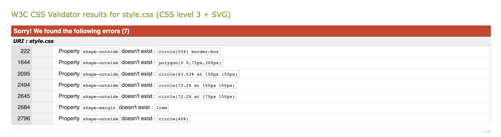
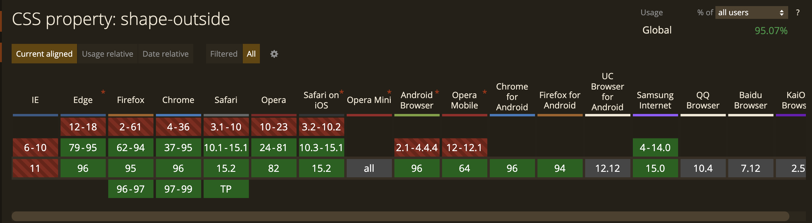
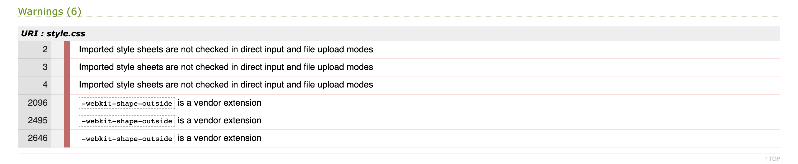
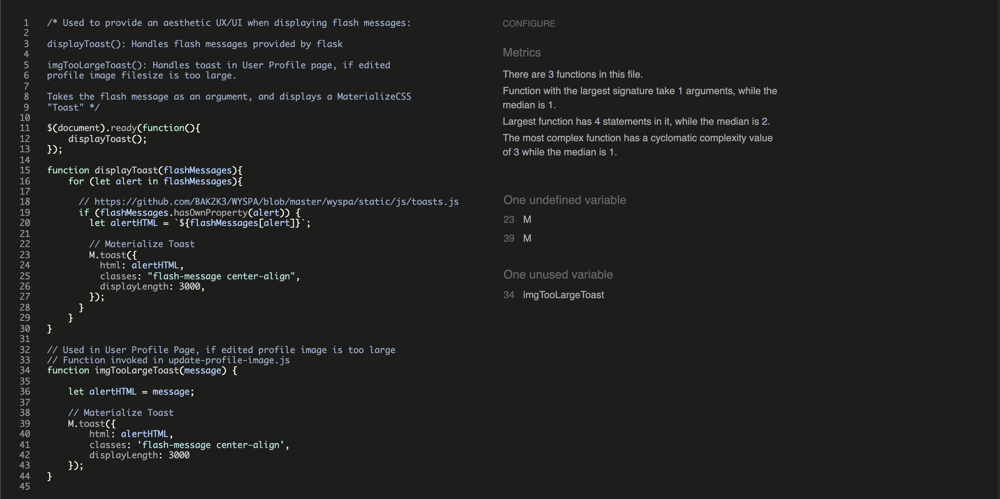
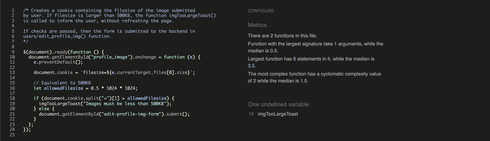

# Cross//Tracks - Testing Details

[Main README.md file](README.md)

## Table of Contents

## Testing 

### Markup Validation

#### HTML

The [W3C HTML Validator](https://validator.w3.org/) was used to check the validity of the source code.

All pages passed through the validator with no errors or warnings to show, apart from one error regarding the MaterializeCSS select dropdown. Details of the error are 
outlined below.

##### Issues

There is one persistent error being thrown by the W3C HTML Validator, which is thrown on all pages that contain a form to add or edit tracks.
The error reads:

`Bad value 'true' for attribute 'readonly' on element 'input'.`

This error is thrown in relation to the select dropdowns provided by the MaterializeCSS framework. The 'true' readonly attribute 
was not added to the source code, but is added automatically by MaterializeCSS when the source code is compiled and rendered on the browser.
Therefore - short of re-factoring the front-end code for the entire website in favour of a framework such as Bootstrap - the steps that should be taken 
to rectify this error seem quite unclear.

#### CSS 

The W3C Jigsaw validator was used to validate the website's CSS source code.

##### Issues

Some errors were thrown when using certain CSS properties on some elements of the page.

The 'shape-outside' and 'shape-margin' CSS properties were used on two classes with float properties, namely the vector graphic on the website's Home Page, and on the Contact page. The shape-outside property intends 
to provide a smooth text-wrap around the images. However, the Jigsaw validator states that these properties don't exist.

Upon consultancy of the Slack community, along with cross-referencing against [Can I Use](https://caniuse.com/), it was found that
this property, along with the 'shape-margin' property, has more than 95% coverage across all browsers. Therefore it was deemed that
it was not considered bad practice to use these properties when designing the website.

Some warnings were thrown in relation to the import of Google Fonts, and the use of the 'webkit-shape-outside' property.
It was surmised that these warnings were thrown due to the fact that the jigsaw validator is unable to directly interpret the source
of the imports and proprietary code. Since Google is an import, and that the 'webkit-shape-outside' property is proprietary code, the validator
would not consider them 'valid code', and therefore would always throw warnings unless they were removed from the file. 

### Python PEP8 Compliancy

All Python source code was cross-referenced against the [PEP8 Online](http://pep8online.com/) compliancy validator, to
check if the code is PEP8 compliant. No errors or warnings are shown.

### JSHint Validation

The JSHint service was used to lint and validate the JavaScript source code used to develop some features of this project.

#### Issues

##### Undefined/Unused Variables

Upon validating the website's JavaScript files, there were some issues regarding unused and undefined variables.

The issues in these images pertain to the instantiation of Materialize Toasts (`M.Toast`) and the `imgTooLargeToast`.
Though these functions/variables may not be invoked in the same file as they are instantiated (and therefore interpreted as being undefined/unused),
 they are included through script tags, in HTML files that contain the the JavaScript files which use the variables/functions, and therefore define/use them.

## User Stories Testing

### Paths Through The Website

There are multiple options the user can take in navigating the website, dependent on their intentions when using the service.

#### Browsing

Upon landing on the website's Home Page, the user is presented with a button 'Find Me A Track', which is linked to the Browse Tracks page.
The inclusion of this button is to re-inforce the website's intention to the user, and to maximise ease-of-use. 

If the user simply wants to browse and search for tracks, the user can take this path:

* Home Page > Browse Tracks > User Profile

The User Profile can be reached by clicking on their profile image at the bottom of the track cards, displayed on the Browse Tracks page.

#### Registration

The Home page features options for the user to sign up. On laptop/desktop sizes, this is presented as a small message in the Home Page's Login window.
A login window was deemed to large for the lack of real-estate on tablet and mobile screens. Therefore, a button is featured at the bottom of the page, accompanied
with a short message to further outline the options to the user.

The path of registration is thus:

Home Page > Register > Build Profile > Profile Page

## Testing User Stories from UX Section of README.md

### New Visitors

As a visitor using the website for the first time, I want...

1. The purpose of the website to be clearly evident upon first visit, so I can be sure that my needs will be met.

    1. A significant amount of consideration was made regarding the naming/branding of the website, in such a way that was
           concise and effective. Eventually, the name 'Cross//Tracks' was chosen, as it has a shared meaning; on the one hand, 
           the website is concerned with sharing and discovering music (tracks). On the other hand, the website is community-oriented,
           and about people discovering new friends through music. The phrase 'Cross Tracks' seemed to be effective, in line with this particular ethos.
        
    2. The website's brand is displayed immediately upon landing on the website's Home Page, accompanied by a short lead paragraph,
           "Make new connections through new music". This lead paragraph is intended to further re-inforce the intention of the website
           to the user.

    3. A button is also presented immediately to the user, inviting them to find tracks, using the website's 'Browse Tracks' page.

    4. Details of the website's purpose, and how the website can be used, are featured on the website's home page.

2. To be able to navigate the website intuitively and with ease, so that my time isn't wasted.

    1. A navbar and footer is present on all pages of the website, with navigation links clearly presented with sufficient colour contrast.
    2. The website's navbar is collapsible, to allow for responsivity on mobile and tablet devices.
    3. As well as having clear navigation, the website's home page features links for the user to visit the 'Browse Tracks' or 'Register' pages.
    4. Should a user be using a laptop or desktop device, a small login window is present to allow for ease on login.
    5. The website's 'Browse Tracks' page features it's own navbar, with options for users to search for tracks, add tracks, or go to their profile.
    6. Users are able to visit other user's profiles by clicking on any of the profile images featured on the track cards, in the 'Browse Tracks' page.
    7. The 'All Tracks' section of the 'Browse Tracks' page is paginated, to minimise cognitive overload and scrolling.

3. To view tracks without having to register, so I can determine whether the website suits my needs.

    1. The navigation link to the 'Browse Tracks' page is present regardless of whether a user is logged in/registered or not.
    2. The option to search for tracks is available to users (in the 'Browse Tracks' page), whether they are logged in or not.

4. To be able to search for tracks based on different criteria (Genre, Artist Name, Year of Release), so I can search for tracks more granularly.
    
    1. A search window is available on the website's 'Browse Tracks' page, enabling the user to search for tracks using the above search terms.
    2. The search window uses AJAX to query MongoDB through the backend, allowing for instant results when a search is made, and minimizing click count.
    3. When the search window is opened on laptop or tablet devices, the background dims through use of an opaque overlay, to allow maximum engagement with the search window.

5. To view comments on a particular track, so I find out what other users have to say about the music and engage with the community.

    1. In the 'Browse Tracks' page, each modal window contains a section displaying comments other users have left on tracks.
    2. Should there be a comment left on a particular track, this is highlighted by use of a FontAwesome speech-bubble icon on the track card,
       along with the amount of comments a track has.

6. To view how many likes a particular track has, so I can determine which tracks are popular.
    
    1. Each track card in the 'Browse Tracks' page features a FontAwesome star icon, accompanied by the amount of likes a track has (if any).

### Returning Visitors

1. To be able to write and edit comments on tracks which have been shared by others, so I can communicate and build relationships with other users of the website.

    1. If a user is logged in, a form is featured on each track modal in the 'Browse Tracks' page, allowing them to leave a comment.
    2. A user's comment is accompanied with FontAwesome edit and trash icons, allowing the user to edit their comment (from within the comment window) 
       or delete their comment.
    3. Timestamps accompany every comment, to inform the user of when the comment was submitted.

2. The details of users who share a particular track to be clearly visible, so I can browse their profile and find out more about their musical tastes.

    1. Every track card featured in the 'Browse Tracks' page features the name of the user who submitted the track at the bottom of the card,
       along with the user's profile image. This image is clickable, and will take the user to the relevant profile upon clicking.
    2. User details are also featured at the top level in all track modals, in the 'Browse Tracks' page.

3. To be able to Add, Edit and Delete my own profile, so I can manage my personal information with ease.

    1. Full CRUD functionality is present, allowing the user to register themselves to the website.
    2. After registering, a form is presented to the user, inviting them to submit further details such as name, age, description
       and 'artist' status.
    

4. To be able to Add, Edit and Delete my own track information, so I can share tracks with other users of the website.

    1. Full CRUD functionality is present, enabling the user to Add, Edit or Delete their tracks.
    2. The user can edit/delete their track either from the 'Browse Tracks' page, or from their own profile page, maximising intuition and ease of use.

5. To be able to save/like tracks which I come across when browsing, so they are saved to my profile.

    1. Each track card featured in the 'Browse Tracks' page features a FontAwesome saw, which the user can click to like and save a track.
    2. The FontAwesome icon changes from an outlined star to a star with colour fill, to give feedback to the user that the track is liked.
    3. Further feedback is given through the increment of the likes count, which accompanies the colour fill of the FontAwesome star.
    4. The like button uses AJAX, to allow for feedback without refreshing the page, allowing for better UX.
    5. All liked tracks are displayed on their own profile, so the user can browse their liked tracks at will.

6. To be able to contact the site owner, so I can leave feedback. 

    1. A contact page is present, and linked in the footer section of each page of the website.

7. To be able to reset my password so I can access the website if I forget my password.

    Unfortunately, the functionality to fulfill this user story hasn't been successfully implemented. This issue is in regards
    to the JSON web token (JWT), which is needed to provide authentication when resetting the password, by determining if the user who is 
    resetting the password is the same user who requested the password reset.

    Though functionality was successfully in place to send the user an email containing the JWT in the URL, as well as a link taking the user
    back to the website's 'Reset Password' page, the developer ran into issues when testing the reset-password form. Upon submission of the
    form, the user would taken to a 404 page, and the form is not submitted. The developer examined the view which handles the form input, and 
    couldn't find the particular bug which was causing this issue. Unfortunately, a solution to the bug has not yet been discovered.
    It is the developer's intention to rectify this error as soon as possible.

### Musicians

As a musician using the website, I want...

1. To be able to display that I am an artist to other users of the platform, so I can market myself and grow my fanbase.

    1. When filling the form in the website's 'Build Profile' page, a checkbox is present along with the text content 'Are you an Artist?'.
       The user can check this checkbox to display their artist status.
    2. A user's 'artist' status is displayed on their profile, next to their profile image.

2. To display my artist status on track cards, so users can easily find tracks added by me.

    1. If a track that is featured on the 'Browse Tracks' page is added by a user with 'artist' status, this is displayed
       in the footer section of the track cards.

3. View how many 'likes' my tracks have, so I can determine how well my fanbase is growing.

    1. 'Likes' information is displayed on the track cards in the 'My Tracks' section of the User Profile.
    2. The amount of likes is accompanied with the same FontAwesome star featured in the 'Browse Tracks' page, 
       to concisely inform the user of the meaning of the number on the card.
    3. If no likes are present, the message 'No Likes' is conveyed to the user, as opposed to no information at all.

## Manual Testing of Features on All Pages

Manual testing was undertaken on the following browser platforms:

* Google Chrome
* Apple Safari
* Mozilla Firefox

### Home Page

1. Navigation Bar
    1. Click on brand logo to visit home page, from all other pages of website.
    2. Navigate to all pages of website using the navigation links.
    3. Change screen size from laptop to tablet to confirm that the navigation bar collapses to a burger icon.
    4. Click the burger icon to confirm the side-nav opens.
    5. Log out to confirm the navbar features links only to Home, Browse Tracks, Register and Login pages.
    6. Log in to confirm the navbar features links to Home, Browse Tracks, Add a Track pages, and the 'My Account' dropdown.
    7. Click on the link to 'My Account' to confirm that a dropdown appears, featuring links to 'My Profile' and a link to Logout.
    8. Click on 'My Profile' and 'Logout' links, to confirm that they are linked correctly, and logout functionality works as intended.

2. Hero Section
    1. On laptop/desktop and iPad screen sizes, confirm that the Cross//Tracks header, lead paragraph and 'Find Me A Track' buttons are all contained
       within the hero image/logo, with sufficient margin from the edges of the hero image.
    2. Collapse to mobile screen size, to confirm that the header and lead paragraph sit above the Cross//Tracks logo, and only the 'Find Me A Track' button sits within.
    3. Collapse to mobile screen size to confirm that the background image featured on tablet/laptop devices disappears.
    
    3. Login Window
        1. Confirm that the login window is present on laptop/desktop device sizes.
        2. Click Login button without entering any information to confirm the 'required' attribute functions correctly.
        3. Click on inputs to confirm the MaterializeCSS inputs focus as intended.
        4. Enter an incorrect username/password to confirm that the flash message displays as intended.
        5. Log in with correct information to confirm that the user is logged in, and is taken to the Home Page (without the login window).

3. 'About Us'/'Using Cross//Tracks' section
    1. Confirm that the text content has sufficient contrast and font size to be legible on all device sizes.
    2. Confirm that the text wraps around the vector graphic without any unattractive word-breaks, on all device sizes.
    3. Collapse to mobile device size to confirm that the two sections span full-width columns.
    4. Confirm that the bulleted list doesn't contain any word-breaks, on all device sizes.
    5. Confirm that the 'Sign Up' button is present and correctly linked to Register page, on mobile device sizes.

### Register Page

1. Navbar 
    1. Repeat verification steps taken in home page testing.

2. Page Layout
    1. Confirm that the vector is present and correctly placed, on tablet, laptop and desktop device sizes.
    2. Collapse to mobile device sizes to confirm that the vector and background are not displayed.

3.  Register Form
    1. Click on the link to 'Login Here' to confirm that the user is took to the Login page.
    2. Click submit button without entering any information, to confirm that the required attribute functions correctly.
    3. Enter information correctly, but with an existing username. Click submit to confirm that the relevant error is thrown.
    4. Enter an incorrect password format and click submit, to confirm that the relevant error is thrown.
    5. Enter a mismatching password and click submit, to confirm that the relevant error is thrown.
    6. Enter all information correctly and click submit, to confirm that the submission is successful, with the relevant flash message.
    7. Confirm that the user is taken to the page to build their profile.

4. Footer 
    1. Repeat verification steps taken in home page testing.
    
### Build Profile Page

1. Design
    1. Collapse to mobile screen size to confirm that background isn't displayed.

2. Heading
    1. Confirm that the welcome message containing `{{username}}` variable renders the correct username as intended.

3. Form
    1. Confirm that the form is centered on iPad, laptop and desktop devices, and spans full-width on mobile screen sizes.
    2. Confirm that the username input is disabled and tooltipped correctly.
    3. Confirm that the username input features the user's username.
    4. Collapse to mobile screen size to confirm that the Profile Image file selector spans full-width.
    5. Select an invalid file format and click submit, to confirm that the relevant error is thrown.
    6. Select an image with filesize larger than 500KB, to confirm that the relevant error is thrown.
    7. Click on the 'Date of Birth' input, to confirm the MaterializeCSS datepicker is displayed.
    8. Select a birthdate, to confirm it is displayed in the correct format.
    9. Enter no details into form and click submit, to confirm that the user is taken to their profile page, with no additional information displayed.
    10. Fill all inputs of the form and click submit, to confirm that the user is taken to their profile page, with additional information displayed.

### Profile Page

1. Header/User Details
    
    1. Confirm that the default user profile image is displayed, if no profile image was supplied in 'Build Profile' form.
    2. Confirm that the user's username and email address are clearly displayed, with sufficient colour contrast and font size.
    3. Confirm that text content 'Artist' with check icon are displayed (if checked in 'Build Profile' form).
    4. If logged in and on own profile:
        1. Confirm that the edit icon is present and correctly placed next to profile image, on all device sizes.
        2. Confirm that 'Edit My Profile' and 'Delete My Profile' buttons are present at bottom of header.
        3. Hover over 'Edit My Profile' and 'Delete My Profile' buttons on laptop/desktop devices, to see if they respond accordingly.
    5. Collapse to mobile device size, to confirm that columns collapse to full-width.
    6. Edit Profile-Image icon:
        1. Log in and navigate to own profile, and click on button to edit profile image.
        2. Confirm that a file selector window opens.
        3. Select an image with incorrect file format, to confirm relevant error message is thrown.
        4. Select an image with a filesize larger than 500KB, to confirm that the relevant error message is thrown.
        5. Select a valid image, to confirm that the profile image is edited successfully, with the relevant flash message.

2. Edit Profile Modal
    1. Click both the icon to close the modal and page outside the modal, to confirm it closes correctly.
    2. If user information is in database, confirm that it is displayed as values in relevant inputs.
    3. Confirm that the username input is disabled and tooltipped correctly.
    4. Edit information in each field and click submit, to confirm that the form functions correctly, and the relevant flash message is displayed.

3. Delete Profile Modal
    1. Click both the icon to close the modal and page outside the modal, to confirm it closes correctly.
    2. Click the button which reads 'No, I Change My Mind!' to confirm it closes the modal.
    3. Click the 'Yes I'm Sure' button, to confirm that the account is deleted successfully, and the user is logged out and taken to the home page, with relevant flash message.
    
4. 'My Tracks'
    
    1. If no tracks present, confirm that the message 'No Tracks' is displayed, both with accompanying vector.
    2. Log in and add a track, to confirm that the tracks are displayed on track cards in the section, with image, track name, artist name, album name and genre.
    3. If there are tracks present, click on the button with FontAwesome 'info' icon, to confirm that it opens the relevant modal window.
    4. If track has no image URL, confirm that the image defaults to the Cross//Tracks logo.
    5. Select 'Yes' when prompted with 'Are you an Artist?' in Edit Profile/Build Profile forms. Add a track, and navigate to user profile, to confirm that the Artist status is displayed on track card.
    6. Log in, add a track and navigate to own profile, confirm that edit and delete icons are displayed correctly.
    7. Log out and visit own profile page, to confirm that the edit and delete icons are hidden.
    8. Click on both edit and delete icons, to confirm that the relevant modal windows are opened.
    9. Collapse to mobile device size, to confirm that columns collapse to full-width.
    

5. 'Liked Tracks'
    1. If no tracks present, confirm that the message 'No Tracks' is displayed, both with accompanying vector.
    2. Log in and like a track, to confirm that it is displayed in the section.
    3. If tracks are present, confirm that the relevant images and track names are displayed.
    4. If there are tracks present, click on the button with FontAwesome 'info' icon, to confirm that it opens the relevant modal.
    5. Log in, like a track and navigate to own profile, to confirm that a button to remove liked track is present.
    6. Click on button to remove liked track, to confirm that the track is removed.
    7. If deleting the last liked track from the section, confirm that the page reloads, and the 'No Tracks' message is displayed, with accompanying vector.
    8. Collapse to tablet/mobile screen size, to confirm that the columns span full-width.

6. Track Info Modal 
    1. Supply an image URL for the track, to confirm that the image is displayed in the modal.
    2. Confirm that the relevant track name, artist name, album name, genre and year-of-release are displayed correctly.
    3. Click both the icon to close the modal and page outside the modal, to confirm it closes correctly.

        

